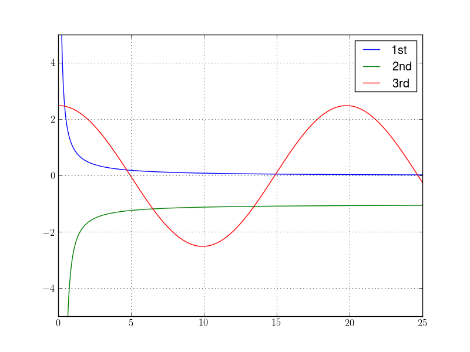
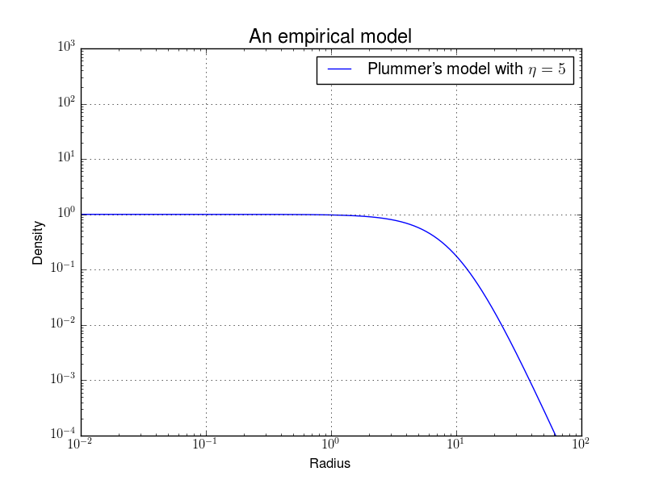
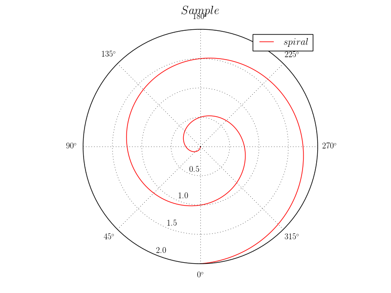
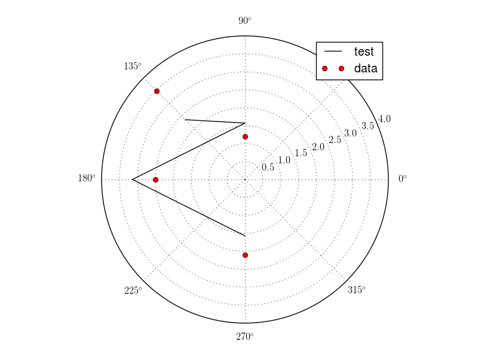
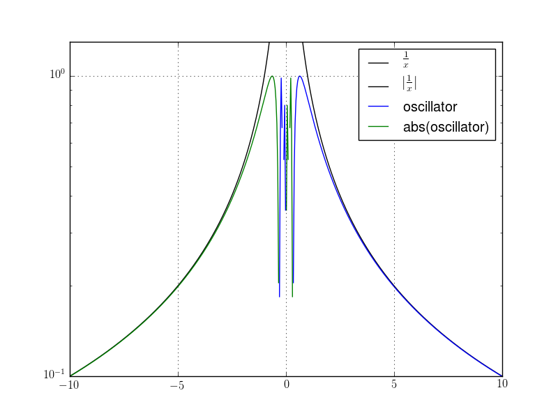

Easy\_plot
==========
A python script of explicit functions: ℝ → ℝ
-------------------------------------------

I wrote this script as a shell command for quickly plotting some functions in linear, semilogx, semilogy, or loglog scales in the Cartesian coordinates, or in the counterclockwise/clockwise Polar coordinates with different offsets of the origin point.  

Moreover, I wrote it as a function, Easy\_Plot(), in the script, so it's convenient to write a python script and import this module to plot diagrams. In this case, there are more features: assigning the title, labels for x and y-axes, (even strings in the Latex forms) and the style of lines. Besides drawing explicit functions, it's also accepted to directly input an array of data as the domain and some arrays of data as the range to plot a diagram!  

[The manual for using as a shell command]
-------------------------------------------

**python easy\_plot.py \[-dDrRPCopeiAN\] 'equation 1 of x' 'equation 2 of x'**...(functions marked by single/double qutoes)  
  
### Options:  
**-d a,b**  
Let the domain to be [a,b]; the default is [-10,10].  
  
**-D a,b,B**  
Similar to '-d', but the log scale of the base B, the default for B is 10.  
  
**-r c,d**  
Let the range to be [c,d]; the default is [-10,10].  
If input **-r'auto'** then it'll be auto scaled.  
  
**-R c,d,B**    
Similar to '-r', but the log scale of the base B, the default for B is 10.  
If input **-R'auto'** then it'll be auto scaled.  
  
**-P c,d**  
Polar coordinate in the counterclockwise direction with the range = [c,d].  
If input **-P'auto'** then it'll be auto scaled.  
  
**-C c,d**  
Similar to '-P', but in the clockwise direction.  
  
**-o t**  
Let the offset for the origin be t radians, the default is 0.  
  
**-p N**  
Let the size of the partition of the domain to be N; if not, the default is 500.  
  
**-e p,q...**  
Exclude points p, q... in the domain.  
  
**-i n**  
Let 'inf' and '-inf' to be n, otherwise printing a warning.  
  
**-A**  
Print all function values of the last one fuction, the 2nd contains abs(negative), if semilogy/loglog.  
  
**-N**  
Don't print the figure.  
  
**-h**  
Print this help information.  
  
  
This script provided some constants, please look them up.  

### An Example:  
    sj@machine ~$ python easy_plot.py -d 0,5**2 -r -5,5 -p 200*2 -e 0,2*10 1/x '-e**(1/x)' '5./2*cos(x/pi)'  

[The manual for using as a python module]
-------------------------------------------
In the python shell, import easy\_plot with the following code:  

    import sys
    sys.path.append('the path of the dir containing easy_plot.py')
    from easy_plot import *

Then you could use the function:  

**[fig, ax, domain, func1, func2] = Easy\_Plot(equ\_list, \*args, \*\*kwargs)**  

**fig** is a matplotlib.figure.Figure object, but if user inputs their own AxesSubplot, fig will be a float number 0.  

**ax** is a matplotlib.axes.AxesSubplot object.  

**domain** is a array of points of the domain.  

**func1** is a list of arrays of function values of equ\_list, but the values beyond the range (when **[a] semilogy/loglog**, and **[b] polar**) will be modified, and the original one will be stored in the corresponding array in list **func2**.  
In **case [a]**, func2 contains abs(negative function value).  
In **case [b]**, func2 contains negative function values.  
Otherwise the corresponding items in func2 will be a string, 'useless'.  

In order to show the figure, please execute:  

    plt.show()

Some modules are already imported in easy\_plot.py   
-------------------------------------------
from numpy import *  
from scipy import special  
import matplotlib.pyplot as plt  
from matplotlib import rc  
from getopt import getopt  
from sys import argv  

Here add some variables, and Latex strings are allowed  
-------------------------------------------
### [equ\_list] (necessary!)  
A list, which can contain strings are functions of x, or/and arrays(numpy) that contains function values. And you can only give a string or an array, if just one function.  
If equ\_list just are some arrays, you can directly see the shape without giving domain and range, but the dimension of them must be the same.  
 
This script also provides a constant values list:  print(const)  
And my function list:  print(func)  

### [args]  
**equ\_label**  
A list of label of functions, e.g.['$x$']; otherwise they'll be ordinal numbers.  
 
**style**  
Cartesian coordinate: 
0: linear plot(default), 1: semilogx, 2: semilogy, 3: loglog.  
Polar coordinate: 
4: counterclockwise, 6: clockwise.  
If some part is beyond the range, it'll be marked by another label automatically.  

**'debug'**  
Print the debug info.  

### [kwargs]  
The default domain = [-10,10], range = [-10,10], and base of log-scale = 10  

**x/domain = [a, b]**  
Let the domain be [a,b]. If log-scale, the base will be 10.  

**x/domain = [a, b, c]**  
Let the domain be [a,b], and the base of log-scale be c.  

**x/domain = a numpy array of data points**  
In this case, the x-scaling is auto.  

**x/domain = [(an array), a, b]**  
Similar to the above, but limit the domain to be [a, b]. If log-scale, the base will be 10.  

**x/domain = [(an array), c]**  
Similarly, but just assign the base of log-scale.  

**x/domain = [(an array), a, b, c]**  
Similarly, but assign the limitation and the base.  

**y/range = [a, b], y/range = [a, b, c]**  
All similar to the above.  

**y/range = 'auto'**  
The y-scaling is auto. But if equ\_list just are some arrays, the y-scaling is already auto.  

**y/range = ['auto', c]**  
The y-scaling is auto, and assign the base of log-scale.  

**offset = t**  
Let the offset for the origin be t radians, the default is 0. Operators are allowed.  

**ax = a matplotlib.axes.AxesSubplot object**  
By this, user create a figure with a set of subplots, then use Easy\_Plot() to plot one of them.  
For example,  
fig, (ax1, ax2) = subplots(2, 1, sharex=True)  
a = Easy\_Plot('x', ax=ax1,...)  
b = Easy\_Plot('1/x', ax=ax2,...)  

**ls = a string** if one plot, or **a list of strings** if more than one plot.  
Assign the style, or/and color of lines in python form, like 'ro' for one plot or ['ro', 'k-'] for two plots. If doesn't assign or assign '', means set by python. But the automatic colors for different parts won't work.  

**color = a string** if one plot, or **a list of strings** if more than one plot.  
Besides 'red' and 'blue' etc., HTML color codes are also fine.  
But the user is suggested not to use ls and color to assign the color of lines at the same time.  

**alpha = a float number** between 0. and 1. if one plot, or **a list of float numbers** if more than one plot.  

**loc = an integer**  
Set the location of legend.  

**p/partition = N**  
Let the size of the parition of the domain to be N; If not, the default is 500. Operators are allowed.  

**ex/exclusion = a number, or a list of numbers.**  
A list of points to be excluded. Operators are allowed.  

**i/inf = n**  
If don't want to get a warning when the value is 'inf' or '-inf', then just let them to be n. Operators are allowed.  

**title = '...', xlabel = '...', ylabel = '...'**  
Assign the title, xlabel, and ylabel. But the labels is only for the Cartesian.  

The type of variables and their default values:  
	|Option     |Accepted assignment                      |Default       |
    |-----|-----|-----|
	|equ_list   |string/array/list of string(s)/array(s)  |[NECESSARY!!] |
	|style      |int                                      |0             |
	|equ_label  |string/list of string(s)                 |Ordinal number|
	|ls         |string/list of string(s)                 |python default|
	|color      |string/list of string(s)                 |python default|
	|alpha      |float/list of number(s)                  |python default|
	|loc	    |int                                      |0             |
	|domain     |array/bracket of numbers -*              |[-10,10]      |
	|range      |'auto'/bracket of numbers -*             |[-10,10]      |
	|base of log-scale|number                     |base of log-scale = 10|
	|offset     |number -*                                |0             |
	|partition  |int -*                                   |500           |
	|exclusion  |list of number(s) -*                     |(empty)       |
	|inf        |number -*                                |(empty)       |
    |title      |string                                   |(empty)       |
    |xlabel     |string                                   |(empty)       |
    |ylabel     |string                                   |(empty)       |
	Suffix -*: Given with mathematical operators are allowed.  

### Examples:  
    result1 = Easy_Plot(['1./(1.+(x/10)**2)**(5/2.)'], ["Plummer's model with $\eta =5$"], 3,  
                        x=[1e-2, 1e2], y=[1e-4, 1e3],  
                        title='An empirical model', xlabel='Radius', ylabel='Density')  

    result2 = Easy_Plot('x/2/pi', '$spiral$', 6,  
                        x=[0, 4*pi], y=[0, 2],  
                        ls='r', offset=1.5*pi, title='$Sample$')  

    result3 = Easy_Plot(['abs(x)', array([2.1, 2.5, 1.2, 3.5])], ['test', 'data'], 4,  
                        x=array([-0.5*pi, pi, 0.5*pi, 0.75*pi]), y=[0, 4],  
                        ls=['k-', 'ro'])  

    result4 = Easy_Plot(['1/x',  'sin(1/x)'], [r'$\frac{1}{x}$', 'oscillator'], 2,  
                        x=[-10, 10], y=[0.1, 1.3],  
                        ls=['k-', ''])

